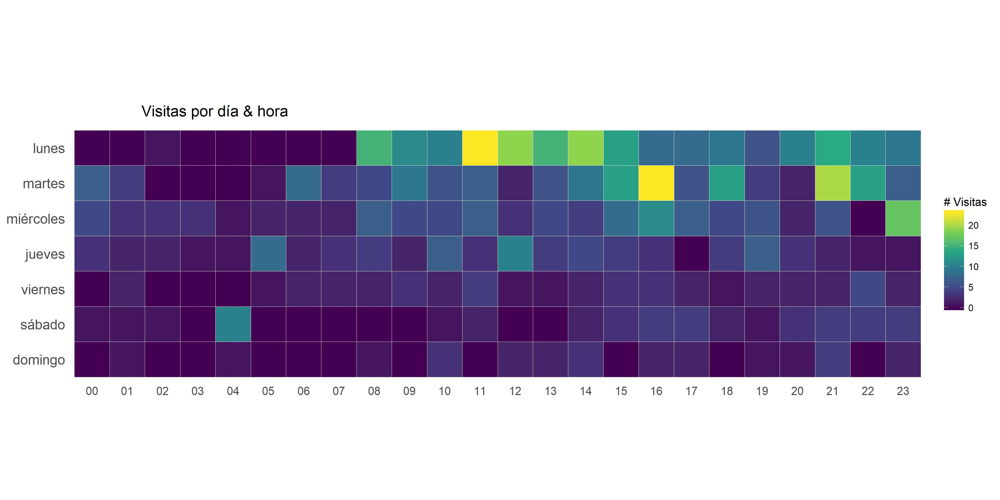
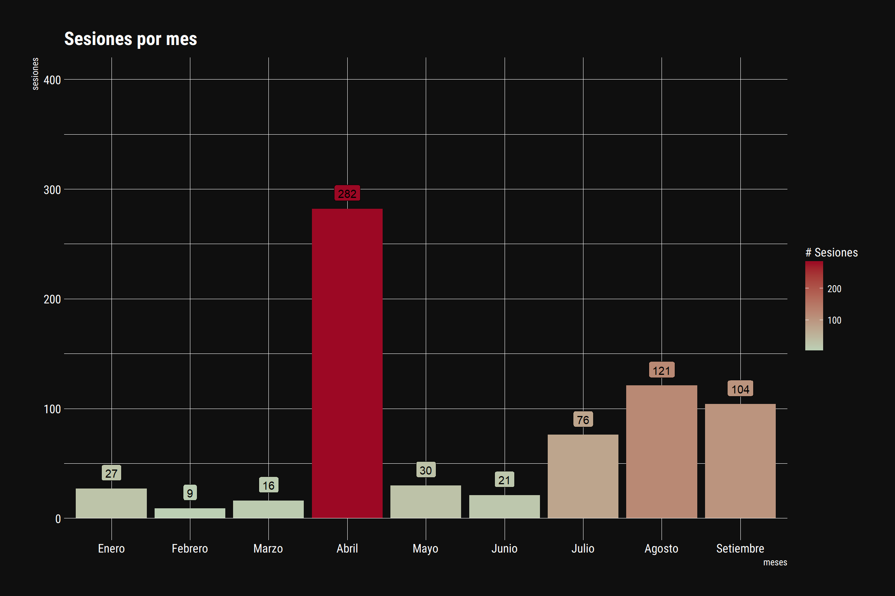

```{r setup, include=FALSE}
knitr::opts_chunk$set(fig.width=12, fig.height=8,
                      echo=TRUE, warning=FALSE, message=FALSE)
```


```{r load_packages, include=FALSE}
library(googleAnalyticsR)
library(ggplot2)
library(dplyr)
library(hrbrthemes)
library(scales)
library(ggthemes)

```


</br>
</br>
</br>


#Google Analytics y R
##Parte II: gráficos con ggplot2


</br>
</br>





En esta entrada les mostraré cómo generar gráficos con la data de Google Analytics en R, con la librería `ggplot2`. 

Hay muchas formas de generar gráficos en R, cada uno con sus ventajas y sus desventajas. El foco aquí sera en el paquete `ggplot2`, que se basa en **The Grammar of Gráfics (by Leland Wilkinson)** para describir gráficos basados en datos.

Basicamente lo que propone este libro es que pensemos en los gráficos como un conjunto de capas que dan sentido a la información. En este conjunto de capas (layers) las principales son los datos y los geomas (*Geoma viene de forma __geom__étrica).


`datos + geomas + title -> gráfico`


[The Grammar of Graphics](http://vita.had.co.nz/papers/layered-grammar.pdf)


[Guía rápida de Ggplot2](https://www.rstudio.com/wp-content/uploads/2016/12/ggplot2-cheatsheet-2.1-Spanish.pdf) Esta es la guía rápida de `ggplot2` donde podrán encontrar casi la totalidad de comandos de esta potente librería de visualización de datos.


Espero que al final del post puedan generar diferentes gráficos con la data de Google Analytics.

</br>
</br>




</br>
</br>
</br>


#Creando un plot

</br>

Lo primero que tenemos que hacer es instalar `ggplot2` con el siguiente comando:

`install.packages("ggplot2")`


Para iniciar un plot utilizamos la función `ggplot()`. Esta función crea un sistema de coordenadas a la que le puedes añadir diferentes capas ("layers") de información. 

El primer argumento de `ggplot()` es la data a utilizar en el gráfico. Así: `ggplot(data = sesiones)`.


También necesitamos definir dentro de la función `ggplot()` los ejes `x` y `y` de nuestro plot. Esto lo definimos dentro de la "minifunción" `aes()`, que especifica que variables se mapean a los ejes `x` y `y`. `ggplot2` busca las variables mapeadas en la data de la función `ggplot()`.


Hasta el momento nuestro código para generar un plot básico quedaría así:

```{r pre-before-plot, eval=FALSE, echo=TRUE, message=FALSE, warning=FALSE}

ggplot(data = mpg, aes(x = displ, y = hwy))

```

Que representa lo siguiente: `ggplot2` utiliza la data `sesiones`, y la columna dia para el `eje x` y la cantidad de sesiones, que se encuentra en la columna sesiones para el `eje y`.


A lo que `ggplot2` nos respondería: ¡perfecto! Vamos bien, pero ahora necesito que me indiques qué tipo de gráfico necesitas: ¿de barras? ¿de puntos? ¿un gráfico lineal, tal véz?


Basicamente nos está diciendo que necesitamos especificar el geoma a utilizar: `geom_*()`, para cada tipo de gráfico existe un geoma diferente. Por ejemplo, la función `geom_point()` añade una capa de puntos al gráfico, lo que crea un `scatterplot` (así se conoce al gráfico de puntos `r emo::ji("relieved")`). 

`ggplot2` viene con varios geomas, cada uno agrega un tipo de capa distinto al plot, entre ellos: `geom_col()`, `geom_point()`, `geom_bar()`, `geom_boxpot()`. 


</br>
</br>


## Estructura de un plot básico

</br>

Nuestro código para generar un plot con la data `mpg` quedaría así:

```{r before-plot, eval=TRUE, echo=TRUE, message=FALSE, warning=FALSE}

library(ggplot2)

ggplot(data = mpg, aes(x = displ, y = hwy)) + 
  geom_point()

```


En resumen:

Para generar un gráfico __básico__ necesitamos las funciones `ggplot()` y un geoma `geom_*()` con sus respectivos argumentos:


1. `ggplot(data = mpg, aes(x = displ, y = hwy))` la función plot indicando con que data se va a trabajar, y los ejes `x` y `y`.  

2. `geom_point()` el geoma a usar. 

3. Y ambas funciones se unen con el signo `+`. 


</br>
</br>


## Estructura de un plot completo

</br>

Para obtener un plot más atractivo visualmente podemos utilizar diferentes funciones dentro del paquete `ggplot2` o ayudarnos de otras librerías como `ggthemes` y `hrbrthemes`. 

En la siguiente imagen utilizamos la misma data del plot básico, solo que le agregamos las funciones `labs()` (para agregar título, subtítulo, nombre eje `x` y `y`) y `theme_ipsum_rc()` (esta función transforma la apariencia del plot, según características determinadas por el autor de la librería). `labs()` pertenece a la librería `ggplot2`, mientras que `theme_ipsum_rc()` a la librería `hrbrthemes`.


Dentro de `ggthemes` también existen otras funciones para cambiar la apariencia del plot, tales como:

* theme_economist() #en referencia a The Economist.
* theme_gdocs() #gráficos con apariencia de Google Docs.
* theme_fivethirtyeight() #en relación a la famosa página de visualización de datos (fivethirtyeight.com).   
* theme_tufte() #Basada en el libro "The Display of Quantitative Information" de Edward Tufte.


```{r complete-plot-hrbrtheme, message=FALSE, warning=FALSE, results="hide"}


library(ggplot2)
library(ggthemes)
library(hrbrthemes)

title <- "Eficiencia del motor vs capacidad de combustible" 

bb <- ggplot(data = mpg, aes(x = displ, y = hwy, color = class)) 
bb <- bb + geom_point(size = 2)
bb <- bb + labs(x="displ", y="hwy", title= title)
bb <- bb + theme_ipsum_rc()
bb <- bb + ylim(0,50)
bb


```


</br>
</br>

### The Economist: mismo plot pero con el theme_economist()

El `theme_economist()` hace referencia a la famosa revista [The Economist](https://www.economist.com/).


```{r complete-plot-economist, message=FALSE, warning=FALSE, results="hide"}


library(ggplot2)
library(ggthemes)
library(hrbrthemes)

title <- "Eficiencia del motor vs capacidad de combustible" 

bb <- ggplot(data = mpg, aes(x = displ, y = hwy, color = class)) 
bb <- bb + geom_point(size = 2)
bb <- bb + labs(x="displ", y="hwy", title= title)
bb <- bb + theme_economist()
bb <- bb + ylim(0,50)
bb


```

</br>
</br>


#Google Analytics: gráficos

</br>

##Obteniendo la data para generar nuestros gráficos con la data de GA 

</br>


Ahora que ya tienes los conceptos básicos para generar un plot, vamos a extrar la data directamente desde **Google Analytics** para empezar a trabajar.

En este [post](googleAnalyticsR.html) explico cómo obtener la data desde el *API* de *GA*, si necesitan más detalles sobre el proceso les recomiendo revisarlo. En esta ocasión solamente les muestro el código que utilizaremos para generar nuestros gráficos.


Vamos a obtener 3 data frames: 

a.`sesiones`: con las columnas `date`,`hour`, `source`, `medium`, `sessions`.

b.`sesiones_por_horas`: con las columnas `date`, `hour`,`sessions`.

Si notaron, los datos de `sesiones` contienen los datos de `sesiones_por_horas`. Entonces, ¿por qué hacemos 2 llamadas distintas al API de GA, si son los mismos datos?

Básicamente la respuesta es porque el *API* de *GA* soporta un límite en la combinación dimnesiones y métricas cuando se realizan las consultas, si forzamos el API podemos obtener datos erróneos.


No olvides utilizar Goolge Analytics - Query Builder, de la cual les conté en el post anterior, para comprender mejor qué dimensiones y qué métricas pueden utilizarse en conjunto (y evitar que el API de GA explote) `r emo::ji("stuck_out_tongue_winking_eye")`.


[Google Analyitcs - Query Builder](https://ga-dev-tools.appspot.com/query-explorer/ "Google Analytics - Query Builder")


```{r sesiones, eval=TRUE, cache=TRUE, message=FALSE, warning=FALSE}

library(googleAnalyticsR)

#Autoriza  Google Analytics R- esto abrira una ventana
#en tu navegador web. Deberás loggearte con el email 
#con el que ingresas normalmente a Google Analytics.

ga_auth()

#Utiliza el Google Analytics Management API para ver
#una lista de las cuentas de Google Analytics a las que 
#tienes acceso.

my_accounts <- ga_account_list()

#Usa la variable my_accounts para encontrar el viewId (Id de la vista)
#Asegúrate de reemplazar el valor de my_id con el ID correcto.


my_id <- 91285066

#Configura variables para una selección de fechas dinámica

start_date <- as.Date("2017-01-01") 
end_date <- Sys.Date() - 1


#Session Query por fuente y medio - usa start_date y end_date

sesiones <- google_analytics_4(my_id, 
                                    date_range = c(start_date, end_date),
                                    metrics = c("sessions"),
                                    dimensions = c("date","hour", "source", "medium"))


#Session Query por hora - usa start_date y end_date


sesiones_por_horas <- google_analytics_4(my_id, 
                                    date_range = c(start_date, end_date),
                                    metrics = c("sessions"),
                                    dimensions = c("date", "hour"),
                                    anti_sample = T)


```


</br>
</br>

##Inspeccionando los datos con los que vamos a trabajar


</br>


Para conocer los datos que obtuvimos de nuestras llamadas al API, vamos a inspeccionarlos con las funciones:

`str()` y `head()`

1. `str`: esta función nos permitirá conocer nuestras variables (la cantidad de columnas) y  las observaciones(filas) de los datos, así como el qué `tipo de datos` con los que contamos. 

Por ejemplo, nuestro data frame `sesiones` consta de: `472 obs. de  5 variables`. 

Estas 5 variables, que, comúnmente, nosotros conocemos como columnas son de los siguientes tipos:

* `date`: de tipo `Date`.
* `hour`: de tipo `chr` (character o texto).
* `source`: de tipo `chr` (character o texto).
* `medium`: de tipo `chr` (character o texto).
* `sessions`: de tipo `num` (numérico).


Cada tipo de variable tiene propiedades distintas, por ejemplo: las variables de tipo `chr` no se pueden sumar, mientras que las de tipo `num` sí. En otro post explicaremos más a detalle esto, ya que es necesario tener claras las diferencias entre los distintos tipos. En este caso, al obtener las variables en el tipo adecuado no nos es necesario hacer ningún tipo de transformación. Repito, sino entiendes esto último no te preocupes, en el próximo post lo explicaré a detalle `r emo::ji("innocent")`.

2. `head()`: Además de la función `str()`, podemos utilizar la función `head()` para conocer las primeras observaciones (filas) de nuestros datos.


```{r sesiones-datos, eval=TRUE, echo=TRUE, cache=TRUE, message=FALSE, warning=FALSE, dependson=sesiones}


str(sesiones)


head(sesiones, n = 5)


```


</br>
</br>


##Transformación de datos


</br>


```{r data-transformation, message=FALSE, warning=FALSE, dependson='cleaning-data', cache=TRUE}


#####################################
###### Transformación de datos ######
#####################################

### Remove white spaces ambos lados


sesiones$medium <- trimws(sesiones$medium, which = "both")

sesiones$source <- trimws(sesiones$source, which = "both")


#########################################


sesiones$mes <- months(sesiones$date)

sesiones$mes <- factor(sesiones$mes, levels = c("Enero", "Febrero",
                                                "Marzo", "Abril",
                                                "Mayo", "Junio",
                                                "Julio", "Agosto",
                                                "Setiembre"), ordered = T)


sesiones$dia <- weekdays(sesiones$date)

sesiones$dia <- ordered(sesiones$dia, levels=rev(c("lunes","martes","miércoles","jueves",
                                                   "viernes", "sábado","domingo"))) 


sesiones_por_horas$dia <- weekdays(sesiones_por_horas$date)


sesiones_por_horas$dia <- ordered(sesiones_por_horas$dia, levels=rev(c("lunes","martes","miércoles","jueves",
                                                   "viernes", "sábado","domingo"))) 


sesiones_por_mes <- sesiones %>%
  group_by(mes) %>%
  summarise(sessions = sum(sessions))


sesiones_hora <- sesiones_por_horas %>%
                  group_by(dia, hour) %>%
                  summarise(sessions = sum(sessions))


sesiones_por_dia <- sesiones %>%
                    group_by(date) %>%
                    summarise(sessions = sum(sessions))


```

</br>
</br>

##Gráficos estandar de Google Analytics

</br>


### Sesiones por mes 

Recomiendo siempre empezar por un gráfico como este, que muestre el total de los resultados dentro del rango de fecha elegido.

En este caso, estamos viendo los datos desde el "01-01-2017" hasta el día de ayer (01-10-2017) de mi página personal: (www.omargonzalesdiaz.com).

Es bueno empezar contextualizando al lector, y recién luego llevarlo a los detalles.

</br>

```{r sesiones-por-mes, message=FALSE, warning=FALSE, dependson='data-transformation'}

#####################################
############ Gráficos ###############
#####################################

### Sesiones por mes 

title <- "Sesiones por mes" 

dd <- ggplot(sesiones_por_mes, aes(x = mes, y = sessions, fill = sessions, label = sessions)) 

dd <- dd +  geom_col()
dd <- dd + labs(x="meses", y="sesiones", title= title)
dd <- dd + scale_fill_gradient_tableau(name = "# Sesiones")
dd <- dd + theme(plot.title=element_text(hjust=0.1))
dd <- dd + theme(axis.ticks=element_blank())
dd <- dd + theme(axis.text=element_text(size=12))
dd <- dd + theme(legend.title=element_text(size=10))
dd <- dd + theme(legend.text=element_text(size=8))
dd <- dd + theme_ipsum_rc()
dd <- dd + theme_modern_rc()
dd <- dd + geom_label(vjust = -0.5)
dd <- dd + ylim(0,400)
#dd <- dd + geom_label(fill = "white", vjust = -0.5)
dd


```


</br>
</br>

###Sesiones por hora

Me gusta mucho este gráfico: Es bastante claro y tiene muchos _insights_ por contar. 


Por ejemplo, fácilmente podemos identificar que la mayor cantidad de visitas que hemos recibido se ha dado los lunes a las 11 am y los martes a las 4 pm. Y con esta información podríamos planificar mejor los lanzamientos de los posts que se vienen, entre otros detalles.


Sin embargo, muy pocos lo utilizan debido al desconocimiento de cómo desarrollarlo en R. 

Las veces que lo he presentado ha sido del agrado de muchos; incluso, algunos colegas, me han pedido que les enseñe a realizar algo similar en Excel `r emo::ji("sweat_smile")`. 

</br>

```{r sesiones-por-hora, message=FALSE, warning=FALSE, dependson='data-transformation'}

#graph sessions por hora

gg <- ggplot(sesiones_hora, aes(x=hour, y=dia, fill=sessions))
gg <- gg + geom_tile(color="white", size=0.1)
gg <- gg + scale_fill_viridis_c(name="# Visitas", label=comma)
gg <- gg + coord_equal()
gg <- gg + labs(x=NULL, y=NULL, title="Visitas por día & hora")
gg <- gg + theme_tufte(base_family="Helvetica")
gg <- gg + theme(plot.title=element_text(hjust=0.1))
gg <- gg + theme(axis.ticks=element_blank())
gg <- gg + theme(axis.text.y =element_text(size=12))
gg <- gg + theme(axis.text.x =element_text(size=10))
gg <- gg + theme(legend.title=element_text(size=10))
gg <- gg + theme(legend.text=element_text(size=8))
gg


```


</br>
</br>


###Sesiones por día - evolutivo

</br>

Este gráfico nos muestra la evolución diaria de las sesiones. Rápidamente podemos apreciar en qué día hubo más visitas y en qué día hubo menos visitas.

Basicamente notamos que los picos coinciden con el lanzamiento de los posts en el blog.


```{r sesiones-por-dia, message=FALSE, warning=FALSE, dependson='data-transformation'}


#graph sesiones por día - evolutivo


title <- "Sesiones por día"
subtitle <- "Los picos en las visitas coinciden con la publicación de los posts en el blog"


ggplot(data=sesiones_por_dia, aes(x=date, y=sessions)) +
  geom_line(stat="identity") +
  labs(title = title, subtitle = subtitle, x = "", y = "sesiones") +
  theme_ipsum() 


```


###Sesiones por fuente, por mes


####Limpieza de datos


</br>


Aprender a limpiar datos es de suma importancia para cualquier analista. Esta es la parte más tediosa porque consume la mayor parte de nuestras horas de trabajo (¡¡¡y no es divertido!!!).

Era la parte más tediosa, por qué tenemos que hacer este trabajo, si le podemos ordenar a la computadora que lo haga por nosotros (shhh...). 

Lamentablemente, ni la fuente (`source`), ni el medio (`medium`) viene muchas veces en la forma correcta. Por lo que necesitamos generar la columna `fuente` con los siguientes valores posibles: `adwords`, `orgánico`, `email`, `redes sociales`, `linkedin`, `otras`.


Si bien es un tópico sumamente importante, en esta ocasión nos centraremos en explicarles cómo generar los gráficos. Recién, en el siguiente post, que se llamará:  `Usando R para agrupar fuentes de Google Analytics`, veremos cómo limpiar y agrupar las fuentes de forma correcta.

Por ahora, les dejo este gráfico que espero los entusiasme con las posibilidades que ofrece R, y en particular el paquete `ggplot2` para generar programáticamente gráficos con nuestra data de `Google Analytics`.


```{r cleaning-data, eval=TRUE, echo=FALSE, message=FALSE, warning=FALSE, dependson='sesiones'}


#######################################################
################ Limpieza de datos ####################
#######################################################


#######################
### Fuente correcta ###
#######################


sesiones$fuente <- NA


for (i in 1:nrow(sesiones)) {
  
  
  ### PATHs
  
  spam.path <- paste(c("site.*", ".*event.*", ".*free.*", ".*theguardlan.*",".*.\\org",
                       ".*guardlink.*", ".*torture.*", ".*forum.*", ".*buy.*",
                       ".*share.*", ".*buttons.*", ".*pyme\\.lavoztx\\.com\\.*",
                       ".*amezon.*", ".*porn.*", "quality", "trafficgenius\\.xyz",
                       "gametab\\.myplaycity\\.com", "login.*", "mega.*", "blog",
                       "[0-9]{3}\\.[0-9]{2}.*", ".*\\:.*", ".*\\.xyz", "online", "internet"),
                     collapse="|")
  
  
  
  adsense.path <- paste(c("tpc.googlesyndication.com",
                          "googleads[.]g[.]doubleclick[.]net"),
                        collapse="|")
  
  
  
  
  adwords.path <- paste(c("cpc", "search",
                          "ccp","google_display",
                          "cpm","cpv","youtube.*","video.*",
                          "google", "google_blast","(not set)"),
                        collapse="|")
  
  
  
  
  email.path <- paste(c(".*mail.*", "newsletter"
  ),
  collapse="|")
  
  
  
  
  referral.path <- paste(c(".*google\\.com\\.pe.*",
                           ".*google\\.co\\.ve.*",
                           ".*google\\.com\\.br.*",
                           ".*google\\.com\\.bo.*",
                           ".*google\\.com\\.ar.*",
                           ".*google\\.com.*",
                           "sodimac.com.pe",
                           "falabella.com.pe",
                           "beneficios.gruporomero.com.pe",
                           "somossesiones.net","shop.lenovo.com",
                           "canonexperience.pe", "lg.com", "deperu.com"
  ),
  collapse="|")
  
  
  linkedin.path <- "linkedin"
  
  
  
  redes.sociales.path <- paste(c(".*fac?e.*",
                                 ".*twitt?.*","tw.*", "pp.*"),
                               collapse="|")
  
  
  
  ritmo.romantica.path <- paste(c("ritmo.*"
  ),
  collapse="|")
  
  
  
  prensmart.path <- paste(c("prensmart.*"
  ),
  collapse="|")
  
  organic.path <- paste(c("start.iminent.com",".*search.*",
                          "websearch.com","crawler.com|allmyweb.com"),
                        collapse="|")
  
  
  
  otros.path <- paste(c("web", "popup", "contenido"),
                      collapse="|")
  
  
  #direct.path <- "//(direct//).*"
  
  ### GREPL PART
  adsense <- grepl(adsense.path, sesiones$source[i], ignore.case = T)
  
  
  adwords.medium <- grepl(adwords.path,sesiones$medium[i], ignore.case = T)
  
  adwords.source <- grepl(adwords.path,sesiones$source[i], ignore.case = T)
  
  
  email.medium <- grepl(email.path,sesiones$medium[i], ignore.case = T)
  
  email.source <- grepl(email.path,sesiones$source[i], ignore.case = T)
  
  
  
  linkedin.source <- grepl(linkedin.path,sesiones$source[i], ignore.case = T)
  
  
  
  referral.medium <- grepl("referral", sesiones$medium[i],
                           ignore.case = T)
  
  referral.source <- grepl(referral.path, sesiones$source[i],
                           ignore.case = T)
  
  
  spam <- grepl(spam.path, sesiones$source[i],
                ignore.case = T)
  
  
  
  redes.sociales <- grepl(redes.sociales.path, sesiones$source[i],
                          ignore.case = T)
  
  
  ritmo.romantica <- grepl(ritmo.romantica.path, sesiones$source[i],
                           ignore.case = T)
  
  
  
  prensmart <- grepl(prensmart.path, sesiones$source[i],
                     ignore.case = T)
  
  organic <- grepl(organic.path, sesiones$source[i], ignore.case = T)
  
  
  
  otros <- grepl(otros.path, sesiones$medium[i], ignore.case = T)
  
  #directo <- grepl(direct.path, sesiones$source[i], ignore.case = T)
  
  
  
  ### Conditional part
  
  ### Directo tiene un espacio en blanco
  
  if (sesiones$source[i] == "(direct)") {
    sesiones$fuente[i] <- "directo"
  } 
  
  
  else if (referral.source | otros) {
    
    sesiones$fuente[i] <- "referencias"
    
  }
  
  
  else if (sesiones$medium[i] == "organic" |
           organic) {
    sesiones$fuente[i] <- "orgánico"
  }
  
  else if (adwords.source
           & adwords.medium) {
    
    sesiones$fuente[i] <- "adwords"
  }
  
  
  
  else if (adsense) {
    
    sesiones$fuente[i] <- "adsense"
  }
  
  
  else if (email.medium | email.source) {
    
    sesiones$fuente[i] <- "email"
  }
  
  
  else if (linkedin.source) {
    
    sesiones$fuente[i] <- "linkedin"
  }
  
  
  
  else if (redes.sociales) {
    
    sesiones$fuente[i] <- "redes sociales"
  }
  
  else if (ritmo.romantica) {
    
    sesiones$fuente[i] <- "ritmo rom?ntica"
  }
  
  
  else if (prensmart) {
    
    sesiones$fuente[i] <- "prensmart"
    
  }
  
  
  else if (spam) {
    
    sesiones$fuente[i] <- "spam"
  }
  
  else {
    sesiones$fuente[i] <- "spam"
  }
}


######################


```


</br>
</br>


### Sesiones por fuente, por mes

</br>


```{r sesiones-por-fuente, message=FALSE, warning=FALSE, dependson='data-transformation'}


### sesiones por fuente, por mes


sesiones_fuente <- sesiones %>%
                    group_by(mes, fuente) %>%
                    summarise(sessions = sum(sessions))


ee <- ggplot(sesiones_fuente, aes(x = fuente, y = sessions, fill = sessions,
                                   label = sessions)) 
ee <- ee +  geom_col()
ee <- ee + facet_wrap(~ mes) 
ee <- ee + coord_flip()
ee <- ee + labs(x="meses", y="sesiones", title="Sesiones por mes")
ee <- ee + scale_fill_gradient_tableau(palette = "Orange", name = "# Sesiones")
ee <- ee + theme(plot.title=element_text(hjust=0.1))
ee <- ee + theme(axis.ticks=element_blank())
ee <- ee + theme(axis.text=element_text(size=12))
ee <- ee + theme(legend.title=element_text(size=10))
ee <- ee + theme(legend.text=element_text(size=8))
#ee <- ee + theme_ipsum_rc()
#ee <- ee + theme_modern_rc()
ee <- ee + theme_fivethirtyeight()
ee <- ee + geom_label(hjust = -0.5)
ee <- ee + ylim(0,200)
#ee <- ee + geom_label(fill = "white", vjust = -0.5)
ee


```


