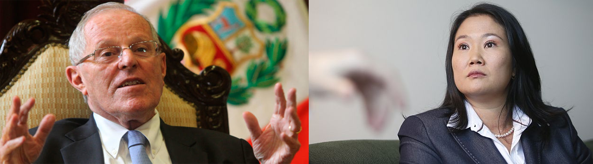
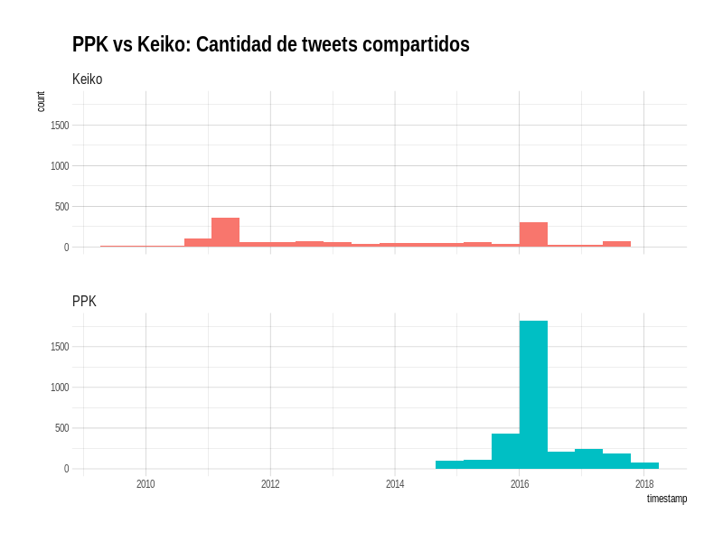
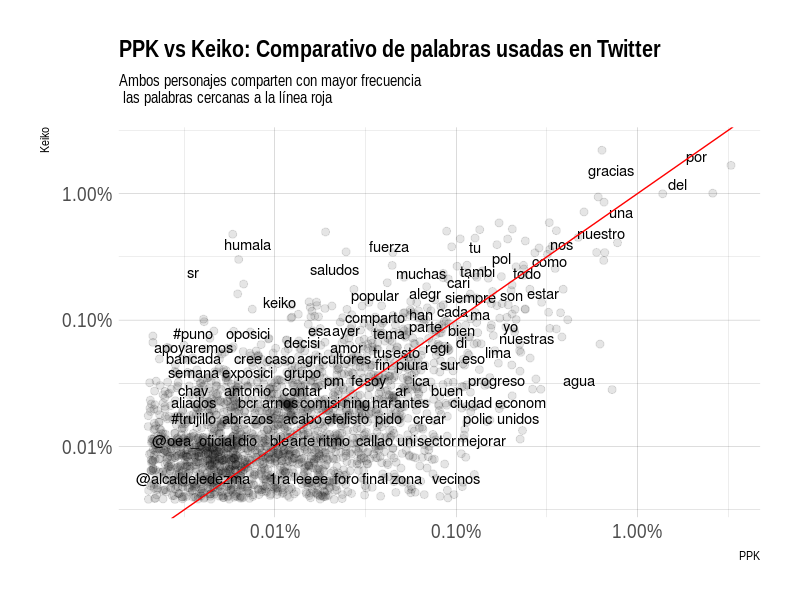

```{r setup, include=FALSE}
knitr::opts_chunk$set(fig.width=12, fig.height=8,
                      echo=TRUE, warning=FALSE, message=FALSE)
```


</br>
</br>
</br>


#PPK vs Keiko en Twitter

</br>
</br>



</br>
</br>

En este post trataré de analizar los tweets publicados tanto por PPK, como por Keiko Fujimori, 2 de los personajes más importantes de nuestro querido Perú.

Con este ejercicio quisiera hacer un análisis de cada una de las palabras de ambos, para esto utilizaré el API de Twitter para extraer los gráficos y las librerías de R para limpiar y generar algunos gráficos.

Este es un trabajo en proceso; trataré de actualizarlo en las próximas semanas. Pot lo que les pediría, en la medida de que les sea posible, me dejen comentarios al final del post con alguna sugerencias para la mejora del mismo. 

Sin más que decir, empecemos con algunos gráficos...


</br>
</br>


#Análisis de la cantidad de publicaciones en la red social Twitter, a lo largo del tiempo

</br>
</br>

Este análisis lo iniciamos con la evolución en la cantidad de tweets publicados a lo largo del tiempo. La data la extrajimos del API de Tweeter, gracias al paquete `rtweet` y la gráfica la hicimos con `ggplot2`.





Como se precia, la cantidad de tweets de Keiko Fujimori ha sido algo constante desde el 2010. Se aprecia una mayor cantidad de publicaciones los años 2011 y 2016, años en los que se desarrollaron nuestras 2 últimas elecciones presidenciales. 

En el caso de PPK se aprecia actividad en Twitter recién a fines del 2014, con mayor intensidad el 2016, año en el que se convierte en nuestro presidente, y luego observamos publicaciones continuas hasta estos días.


Ahora mismo, no logro recordar si PPK fue o no candidato en las elecciones del 2011. Si lo fue, lo más probable es que no haya estado al tanto de esta podersa herramienta de comunicación. Sin embargo, también cabe la posibilidad de que se haya considerado que Twitter no era una plataforma muy popular en el 2011. Sería interesante tener información sobre la cantidad de usuarios de Twitter en esos años (si tienes alguna publicación al respecto, te agradecería la compartas a mi correo: oma.gonzales@gmail.com)

</br>
</br>

#Frecuencia de uso de palabras 

</br>
</br>

En el siguiente gráfico apreciamos las palabras que son usadas con mayor frecuencia por ambos personajes. Las palabras más cercanas a la línea roja son las que tienen una frecuencia de uso similar por parte de ambos personas, mientras que se alejan hacia la izquierda son las que Keiko usa en mayor cantidad, y las que se alejan a la dercha las que PPK utiliza con mayor frecuencia.





A simples rasgos observo que PPK utiliza con mayor frecuencia palabras como: agua, vecinos, economía, mejorar, progreso. Mientras que Keiko utiliza con mayor frecuencia: humala, fuerza, bancada,comparto, amor. 

Traté de limpiar bien la base de datos de las famosos "stop words", en su mayoría conjunciones como "y" o preposiciones como "con", "de", "en". 

Repito, este es un trabajo en progreso. Espero en los próximos días analizar más a profundidad a estos candidatos y sacarle el juego al API de Twitter en el proceso. 
Les agradezco de antemano los comentarios sobre el post, así como sugerencia de gráficos sobre el tema. 

Omar.


  